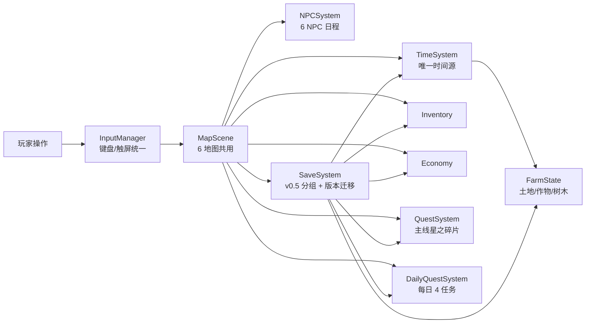

# 《归星物语》顶层设计文档（Top-Level Design）

> 定位：产品 / 设计 / 制作层面的最高决策参考文档，从**游戏制作人视角**出发，覆盖玩家体验、情绪曲线、内容叙事、数值平衡、验收标准与风险管理，而不仅是开发与程序问题。
>
> 与现有文档的关系：
> - `AGENTS.md` —— 开发纪律与禁止事项（稳定 > 新功能）
> - `需求文档.md` —— 功能级 PRD（系统规格）
> - `剧情.md` —— 剧情与世界观
> - `维护说明.md` —— 技术架构与维护手册
> - **本文档 —— 为什么做、为谁做、做到什么程度算好、下一步做什么**

---

## 0. 文档信息

| 项目 | 内容 |
|------|------|
| 版本 | v0.5 |
| 更新日期 | 2026-08-02 |
| 适用阶段 | Alpha 稳定期（15~30 分钟完整体验 Demo） |
| 设计负责人 | opencode（制作人接管：顶层设计 / 决策 / 评审，只读代码 + 只写设计文档） |
| 实现负责人 | opencode / trae（代码、测试、资源） |

### 变更记录

| 日期 | 版本 | 变更 |
|------|------|------|
| 2026-08-02 | v0.5 | **制作人接管**：Codex 退出设计负责人，由 opencode 接任（顶层设计 / 决策 / 评审）；确认执行原则「先稳定再打磨」；第一优先事项 = BUG-007 移动端竖屏方案拍板（见 §10.5） |
| 2026-08-01 | v0.1 | 初稿：确立设计支柱、Demo 验收标准、路线图与风险登记 |
| 2026-08-01 | v0.2 | 剧情主线定稿：主题反转 / 爷爷三件套节奏 / 神秘少女定位；Demo 收尾演出设计登记 |
| 2026-08-01 | v0.3 | 编剧审查修订：序章独白压缩 / 辞退邮件弱化AI反派感 / 去"最后的信"剧透 / 第一章补程序员能力展示 / 观星夜静默镜头 / 选择改"试着留下" / 收尾状态改用 storyStep（暂缓新存档字段） |
| 2026-08-01 | v0.4 | 制作人拍板：第一章结束流程定为「夜晚观星点触发」（非交付碎片立即演出），流程 = 完成碎片委托 → 等待夜晚 → 前往庄园观星点 → 触发爷爷信事件 → 玩家选择 → 章节结算 → 进入自由生活；结算面板保留（章节回顾，非"游戏结束"）；存档字段采用 `story.demoEndingDone`（未来正式版改名 `stargazeCompleted`）；本章为 v0.5.1 Alpha Demo 里程碑 |
| 2026-08-01 | v0.4 补充 | 制作人定义 v0.5.2 体验打磨范围（见 §10.2）：目标 = 第一次试玩产生四感受；允许 = 剧情微调 / 表现优化 / 引导优化；禁止（红线）= 新地图 / 新系统 / 第二章剧情 / 神秘少女展开 / 新存档结构 / 好感系统；并确认 opencode 立绘工作不中途介入，等其完整结束后单独 commit → review → merge |
| 2026-08-02 | v0.4.1 | 制作人拍板（方向收敛）：剧情完成状态统一为 `storyStep = 'observatory_complete'`，**彻底移除 `demoEndingDone`**（开发阶段概念，不入游戏世界状态）；三选项对话已实现（非 v0.5.2 待办）；本文档同步对齐已实现代码 |
| 2026-08-02 | v0.4.2 | 制作人拍板：对话肖像显示方案采用 **方案 A**（二游式半身裁切立绘，128×128 桌面 / 96×96 移动端）；表情系统 / 角色尺寸规范暂缓，单图静态起步 |
| 2026-08-02 | v0.4.3 | 立绘展示方式微调：**保留原背景，圆角卡片展示**（去背会损伤发丝/肩部边缘，且背景有艺术价值）；管线改为仅缩放 512×768 |
| 2026-08-02 | v0.4.4 | v0.5.2 Experience Polish **已批准范围**登记（§10.4）：四感受 / 允许三类 / 禁止红线 / 执行顺序；P0 存档补强 + 第一章 E2E（24 项）已落地 |

> 设计变更必须在本文档登记后方可进入实现（详见 §12 决策流程）。

---

## 1. 设计支柱（Design Pillars）

所有功能决策以此五条为判据，冲突时按顺序取舍：

1. **治愈与返乡的情绪内核** —— 玩家扮演被 AI 时代淘汰的程序员，从"追赶"切换到"照料"。每一个系统都要服务这个情绪，而不是服务于"系统数量"。
2. **三分钟上手，十五分钟入心** —— Demo 必须在 3 分钟内让玩家完成第一次有效操作，15 分钟内出现第一个情感高点，25 分钟内完成情感闭环。
3. **稳定即信任** —— 对 Demo 而言，一次黑屏或坏档 = 全部分数归零。稳定优先级高于任何新功能。
4. **少而完整** —— 一个闭环 > 十个半成品。砍掉 50% 的功能，把剩下的做到无瑕疵。
5. **星之碎片 = 长线钩子** —— 收集碎片 + 岛屿苏醒谜题是跨章节的主线，也是 Demo 结尾"意犹未尽"的来源。

---

## 2. 目标玩家与核心体验

### 2.1 目标玩家画像

| 画像 | 特征 | 触发点 |
|------|------|--------|
| 种田游戏爱好者 | 星露谷 / 牧场物语玩家 | 耕作闭环、收集、NPC 社交 |
| 二游 / 米哈游式用户 | 重视演出、角色、情绪 | 全屏对话演出、像素美术、星之碎片悬念 |
| 轻量休闲玩家 | 单次游玩 15~30 分钟 | 一天 = 8 分钟、低压力、无惩罚 |

### 2.2 Demo 情绪曲线（制作人最关心的一张表）

目标是"**共鸣 → 成就感 → 治愈 → 期待**"四段式：

| 阶段 | 时间预算 | 情绪目标 | 设计手段 |
|------|---------|---------|---------|
| 序章（车站） | 2~3 分钟 | 共鸣、好奇 | 内心独白 + AI 辞退邮件 + 手机新闻反差 |
| 教程（大门→农场） | 5~7 分钟 | 上手成就感 | 夏雅引导，锄地/播种/浇水各 3 次的微任务节奏 |
| 第一天傍晚 | 1~2 分钟 | 治愈感初现 | 晚霞对话 + 手机新闻再次对比 + 睡觉存档 |
| 探索期（小镇/森林/矿洞） | 5~8 分钟 | 发现的乐趣 | 小镇开场、6 NPC、碎片采集、商店经济 |
| 第一章收束 | 2~3 分钟 | 温暖与期待 | 交付星之碎片、村长台词、碎片（1/…）钩子 |
| **Demo 结尾（v0.5.1 已完成）** | 1~2 分钟 | **完整感 / 意犹未尽** | 夜晚观星点触发收尾剧情 + 章节结算面板 + 继续自由游玩 |

> 曾是最**大体验缺口（没有结尾）**，v0.5.1 Alpha 已补齐：玩家在"碎片（1/…）"处不再被切断，夜晚观星收尾带来完成感。

---

## 3. 玩法循环设计

### 3.1 三层循环

```
分钟级：移动 → 交互 → 即时反馈（音效/文字/动画）
   ↓
日级：  起床 06:00 → 种田/挖矿/砍树/社交/交易（体力 100，22:00 截止）→ 睡觉 → 成长结算 + 存档
   ↓
章节级：序章（归乡）→ 第一章（小镇居民/星之碎片）→ 第二章（星坠的秘密）→ 第三章（归位，多结局）
```

### 3.2 乐趣来源与现状缺口

| 乐趣来源 | 当前实现 | 缺口 |
|---------|---------|------|
| 种植成长（等待→收获） | ✅ 4 作物 + 成长判定 | 收获瞬间缺少"惊喜"（如随机品质） |
| 收集（图鉴感） | 部分（18 种物品） | 无图鉴/收集奖励，玩家没有"集齐"目标 |
| 探索（新地图发现） | ✅ 6 地图 | 海滩等新地图（v0.6） |
| 社交（NPC 关系） | 部分（固定对话） | 无好感度，对话永远是同一套 |
| 经济（赚钱→升级） | ✅ 商店闭环 | 花钱出口只有种子，缺少中期消费目标 |
| 叙事（情感驱动） | ✅ 序章 + 第一章 | Demo 结尾缺失 |

---

## 4. Demo 验收标准（15~30 分钟完整体验）

### 4.1 玩家验收路径（DoD Checklist）

新玩家从零开始，一次完整游玩必须能完成：

- [ ] 3 分钟内完成首次锄地（教程引导有效）
- [ ] 无黑屏、无卡死、无报错遮罩（全程）
- [ ] 完成第一天：播种→浇水→睡觉→存档成功
- [ ] 进入小镇触发第一章开场剧情
- [ ] 接受主线任务"星之碎片"，森林采集成功
- [ ] 交付碎片，第一章剧情收束
- [x] **看到 Demo 结尾（v0.5.1 已实现）：夜晚观星收尾 + 章节结算面板 + 自由游玩入口**
- [ ] 中途关闭页面再打开，进度完整恢复（存档可靠性）
- [ ] 移动端（触屏）可完成上述全部路径

### 4.2 体验指标（可度量，试玩时采样）

| 指标 | 目标值 |
|------|--------|
| 首次有效操作时间 | ≤ 3 分钟 |
| 首次收获时间 | ≤ 12 分钟 |
| 首次主线任务完成 | ≤ 25 分钟 |
| 全程无黑屏/坏档 | 100% |
| 存档恢复成功率 | 100% |
| 玩家"愿意继续玩"比例 | ≥ 80%（试玩后询问） |

---

## 5. 内容与叙事设计

### 5.1 章节结构

| 章节 | 标题 | 状态 | 核心内容 |
|------|------|------|---------|
| 序章 | 归乡 | ✅ v0.4 | 车站 → 大门 → 农场，第一天 |
| 第一章 | 小镇的居民 | ✅ v0.5（缺结尾） | 小镇开场、星之碎片主线 |
| 第二章 | 星坠的秘密 | 计划 v0.6 | 钓鱼、好感度、工坊、海滩、夏雅背景 |
| 第三章 | 归位 | 远期 | 碎片集齐、岛屿苏醒、多结局（留岛/返城） |

### 5.2 核心角色

| 角色 | 身份 | 叙事功能 |
|------|------|---------|
| 林澈（主角） | 被 AI 淘汰的程序员，27 岁 | 玩家情绪载体，"慢下来"的转变 |
| 夏雅 | 镇长助理/机械维修师，20 岁 | 新手引导者 + 第二章情感线 |
| 村长 | 爷爷的老友 | 世界观传达者、主线任务授予者 |
| 神秘少女 | 岛屿星光的守护者 | 长线悬念、星辰与碎片关联 |
| 其余 NPC | 矿工/花匠/冒险家/商店老板 | 世界感、每日任务载体 |

### 5.3 叙事原则

1. **情感先于说明**：系统教学融入剧情对话（夏雅给工具时顺便教操作），不出现"操作手册式"弹窗。
2. **城市与岛屿的对位**：手机新闻 / 邮件是"旧世界"的锚点，每次出现都要与当下的田园形成情绪反差。
3. **星之碎片串联一切**：收集驱动 + 世界观悬念，是唯一允许跨版本长期存在的主线。
4. **对话演出分级**：主线用全屏打字机 + 立绘；普通 NPC 用气泡；系统提示用短文本。避免演出通胀。

### 5.4 剧情定稿（2026-08-01 决策登记）

以下为制作人已拍板的剧情主线设定，所有实现必须遵循；后续章节展开以此为准，避免吃书。

**① 主题表述（定稿）**

- 不写"城市坏、乡村好"的二元对立，也不写"AI 是坏的"。
- 主线命题：**失去人的技术 vs 服务于人的技术**。
- 林澈不是逃离技术，而是重新找到技术与人的关系；岛需要理解、观察、创造的人，他的能力第一次有了意义。

**② 爷爷三件套（递进节奏，Demo 只放第一件）**

| 章节 | 媒介 | 叙事作用 |
|------|------|---------|
| Demo（v0.5.x） | 爷爷的信 | 回答"为什么爷爷留下这个地方"，让爷爷成为"一个人" |
| 第二章 | 星图 | 从"家族遗产"推进到"星轨秘密" |
| 第三章 | 观察日记 | 揭开"爷爷为什么等林澈回来" |

递进逻辑：信 = 爷爷想念你 → 星图 = 爷爷寻找答案 → 日记 = 爷爷守护答案。

**③ 神秘少女（定稿为星轨守护者，但 Demo 不揭底）**

- 身份只有作者/设计知道，玩家不知道。
- Demo 只给异常点，不解释、不跟进："你终于回来了。""不认识……只是觉得你应该会来。""它沉睡太久了。"

**④ 第一章结束流程（v0.4 定稿：夜晚观星点触发）**

- 完整流程（制作人拍板，实现与文档以此为准）：

  ```
  完成碎片委托（白天）
      ↓ 等待夜晚
  前往庄园观星点（20:00 后出现发光点 ✦）
      ↓
  触发爷爷信事件（观星收尾剧情）
      ↓
  玩家选择（试着留下 / 不知道答案 / 至少今晚）
      ↓
  章节结算（结算面板 = 章节回顾，不是"游戏结束"）
      ↓
  进入自由生活（存档标记，只触发一次）
  ```

- **触发时机**：不是"交付碎片后立即演出"。白天完成任务 → 夜晚玩家独自来到庄园观星点 → 仰望星空 → 触发爷爷留下的信。这是仪式性的时刻，契合"归星"主题，而非普通任务奖励。
- 情绪目标：让玩家第一次感到"爷爷是个人"，并让林澈第一次主动选择；情绪最高点是停顿（静默镜头），不是台词。
- 选择方向（编剧审查修订）：不是"留下"，而是"试着留下"——Demo 结束时林澈只是愿意尝试。
- 状态标记（v0.4.1 收敛）：剧情完成状态统一用 `storyStep = 'observatory_complete'`（storyStep 本就在存档中，**零新增字段**）。**不引入 `demoEndingDone`**——它是开发阶段概念，不该进入游戏世界状态；正式版玩家完成第一章观星后，世界状态就是 observatory_complete。
- 结算面板：保留（章节回顾 + 统计），是玩家第一次意识到自己完成了一段旅程。
- 完整脚本与实现要求见《任务-剧情Demo收尾观星夜.md》及当前实现（`DEMO_ENDING_DIALOGUE` / `EndingPanel.ts` / `MapScene.ts` 观星点）。

**⑤ NPC 一句话小故事（Demo 每人一句，不一次塞满）**

- 老张："年轻的时候，我也想离开这里。"
- 小梅："这花不是卖的，是有人托我种的。"
- 阿风："森林深处……有些东西，最好别惊醒。"

---

## 6. 系统设计总览

### 6.1 系统拓扑



### 6.2 各系统设计意图（为什么存在，而非功能清单）

| 系统 | 设计意图 |
|------|---------|
| TimeSystem | 制造"一天"的节奏感与期待感（晚上收菜、睡觉结算）；唯一时间源，禁止双源 |
| Stamina | 制造每日决策（种田/挖矿/砍树如何分配 100 体力），而非惩罚 |
| 主线任务 | 给 Demo 一个明确目标与情感出口 |
| 每日任务 | 提供第二天继续玩的理由 + 钻石这一中期货币的入口 |
| 商店经济 | 让收获有价值、让金币有消耗出口；v0.5 后应逐步增加中期消费目标 |
| 存档 | 玩家的信任底线：睡觉必存、退出必存、坏档必可恢复 |
| 新手教程 | 与序章剧情合一，让"学操作"本身就是情绪体验 |

### 6.3 耦合规则（技术红线，设计上同样适用）

1. 天/时间只允许在 `TimeSystem.nextDay()` 递增，一切跨天结算挂在其后。
2. 模块状态必须可被 `SaveSystem` 完整序列化/恢复——新增任何"记住的东西"都要进存档。
3. 数值单一来源：一种商品的价格只允许定义一次（当前违规点见 §7.3）。
4. 新增玩法优先复用 `MapScene` 模式（一张地图 = 一份配置 + 少量专属逻辑），禁止复制场景。
5. 新增物品必须一次性更新：`Inventory.ItemType`、`ITEM_DEFS`、商店、存档（自动覆盖）、PRD 附录。

---

## 7. 数值与经济设计

### 7.1 经济闭环现状

```
买种子(10G) → 种 1 天 → 收萝卜卖 15G → 净赚 5G/天
           → 挖矿零成本，产 5~30G，耗体力
           → 钻石：每日任务奖励，未来消费（中期目标）
```

| 作物 | 种子价 | 售价 | 生长 | 日均净利 |
|------|-------|------|------|---------|
| 萝卜 | 10G | 15G | 1 天 | +5G |
| 番茄 | 20G | 35G | 2 天 | +7.5G |
| 玉米 | 15G | 25G | 3 天 | +3.3G |
| 草莓 | 50G | 80G | 3 天 | +10G |

### 7.2 时间—体力预算（一天 8 真实分钟 / 100 体力）

- 种植 10 块地 ≈ 锄地 10 + 播种 10 + 浇水 10 = 30 体力
- 挖矿一轮（3 石 + 2 铜 + 1 铁）= 5×3 + 10×2 + 15 = 50 体力
- 砍树 2 棵 = 30 体力
- 设计意图：**一天无法同时做完所有事**，玩家必须做选择——这正是"慢生活"节奏的来源。Demo 阶段可稍宽容，避免新手卡体力。

### 7.3 数值单一来源（当前风险）

作物价格目前存在于三处：`FarmState.CROP_DEFS`、`Economy.ts` 常量、`ShopPanel.ts` 内联数字（萝卜种子 10G / 番茄 20G 为硬编码）。**必须收敛为单一数据源**（建议以 `CROP_DEFS` 为准，商店与 Economy 全部读取引用），否则调整平衡时必然漏改。

---

## 8. UI/UX 与新手引导

### 8.1 HUD 信息优先级

```
第一优先级（常驻）：时间、金币、体力、任务目标
第二优先级（按需）：等级/经验、种子数量、钻石
第三优先级（临时）：教学提示、收获反馈、剧情气泡
```

### 8.2 反馈闭环原则

每一次有效操作必须有三级反馈：**视觉（作物变化/飘字）→ 听觉（WebAudio 音效）→ 状态（HUD 更新）**。当前已基本达标，缺口在"领取每日任务奖励后 HUD 钻石数不即时刷新"这类细节。

### 8.3 移动端原则

- 触屏必须能完成全部验收路径（虚拟摇杆 + 交互键已有）。
- 移动端信息精简（HUD 分级已有），对话框底部居中（已有）。
- 存档对移动端尤其重要：`beforeunload` 不可靠，需要 `pagehide`/切场景增量保存兜底。

### 8.4 引导即叙事（当前做得好的部分，继续坚持）

教程不叫"教程"，而是夏雅带林澈认识庄园的第一天。锄地/播种/浇水各 3 次的节奏与"从零开始重建"的叙事完全同构——这是本项目最正确的设计决策之一，后续系统教学必须沿用此法。

### 8.5 对话肖像显示方案（v0.4.2 决策：方案 A）

**背景**：立绘生成规格为 1024×1536 半身像（脸占六成、含发型/服装/肢体/气质），直接压成 56×56 会废掉二游立绘的表现力；本作定位"二游版星露谷"，对话表现应向二游剧情靠拢。

**决策（方案 A：对话框头像升级为半身裁切立绘）**

- 尺寸：桌面 **128×128**，移动端 **96×96**（`isMobileLayout()` 判断），头像框随对话弹窗底部居中布局
- 裁切方案：源图 1024×1536 保持完整，UI 用 CSS `object-fit: cover` + `object-position: 50% 18%` 默认裁到头部/肩胸——**无需为每个角色单独出裁切图**，降低管线成本；接线时按角色微调锚点
- 回退：无立绘角色（村长/神秘少女/老张等）沿用现有"首字色块"占位，有立绘即替换；首批接入 **林澈 / 夏雅**
- 管线（v0.4.3 修订）：选定 seed 后 Pillow 缩放至 512×768（**保留原背景**，圆角卡片展示；去背会损伤发丝/肩部边缘）；输出 `public/assets/portraits/linchen.png` / `xiya.png`，原始大图保留在 `src/`

**暂缓项（不阻塞接线，明确留口）**：

- 表情系统：单图静态起步；后续扩展多表情图（default/smile/sad），`DialogueLine` 增加情感标记选图——当前不做
- 角色尺寸规范：本方案只管对话头像；若后续做"立绘全身演出"（章节过场），另立规范
- 裁切锚点：默认 18%，接线时逐角色视觉校验微调

> 实施前置：立绘选型（每角色从 seed 变体定稿一张）→ 后处理（去白底/透明）→ 再接线。接线设计按本文档执行，不提前实现。

---

## 9. 质量门与测试策略

### 9.1 发布门槛（每个里程碑必过）

1. `npx tsc --noEmit` 通过（strict）
2. `npm run build` 通过
3. E2E 全绿（教程 / 切图挖矿压力 / 砍树）
4. 人工试玩一遍 §4.1 验收路径（含移动端）

### 9.2 自动化覆盖矩阵与缺口

| 测试 | 覆盖 | 状态 |
|------|------|------|
| test-tutorial.mjs | 启动→序章→教程→农场 | ✅ |
| test-stress-switch.mjs | 切图 16 次 + 挖矿，防黑屏 | ✅ |
| test-woodcutting.mjs | 砍树机制 | ✅ |
| 第一章主线（村长→森林→交付） | 主线闭环 | ⚠️ 仅手动探针，需转断言 |
| 商店 / 每日任务 / 存档恢复 / 移动端 | — | ❌ 未覆盖 |

---

## 10. 路线图（制作人视角）

### 10.1 现状盘点（v0.5）

| 维度 | 完成度 | 说明 |
|------|--------|------|
| 核心玩法闭环 | ~85% | 种田/经济/采集/任务全通 |
| 叙事 | ~75% | 序章+第一章完整，缺 Demo 结尾 |
| 稳定性 | ~80% | 黑屏防御到位，存档触发时机有缺口 |
| 美术/演出 | ~60% | 程序化像素达标，NPC 立绘/纹理复用待替换 |
| 测试 | ~65% | 三大 E2E 稳固，主线/存档/移动端未覆盖 |

### 10.2 建议节奏

```
v0.5.1 Alpha（已完成：Demo 收尾里程碑）
  - Demo 结尾（已实现）：夜晚观星收尾（爷爷的信 + 静默 + 三选项）+ 章节结算面板 + 继续自由游玩
  - 美术统一：NPC 独立头像 / 矿脉贴图 / 物品 icon

v0.5.2（体验打磨 — 制作人范围定义 2026-08-01，禁止内容扩展）

  目标：让第一次试玩的人产生四个感受
    1. "我知道林澈为什么回来"
    2. "我喜欢夏雅"
    3. "我想知道爷爷留下了什么"
    4. "我想知道星星是什么"

  允许（只做这三类，避免"顺便加一点"变成 v0.6）：
    - 剧情微调：开场独白压缩 / 夏雅多一句关心 / NPC 加一句生活信息（只动台词，不扩写主线）
    - 表现优化：观星点粒子 / 夜晚音效 / 对话停顿 / UI 反馈
    - 引导优化：第一次种田时夏雅一句"不用急，土地不会催你"这类软引导（替代"按X"硬提示）

  P0（已实现 c9a6130）：观星收尾三选项（试着留下 / 不知道答案 / 至少今晚）
    - StoryDialogue 选项行已支持（`DialogueLine.options`），探针 `probe-stargaze.mjs` 验证通过

  禁止（红线，触发即视为违规）：
    ❌ 新地图 / 新系统 / 第二章剧情 / 神秘少女展开 / 新存档结构 / 好感系统

  opencode 立绘工作：不中途介入、不合并，等其完整结束 → 单独 commit → review → merge

v0.6（内容扩展，Demo 验收后）
  钓鱼（自包含模块）+ 海滩地图（复用 MapScene）
  好感度（轻量：对话变体 + 小任务，禁止复杂养成）
  工坊（中期金币消费出口）

v0.7（第二幕）
  烹饪（体力经济深化）、深层矿洞、建筑升级

v0.8+（完整版）
  节日、成就、图鉴、多结局收束
```

### 10.3 明确不做（与 AGENTS.md 一致，避免 Scope 膨胀）

- ❌ 战斗 / 抽卡 / 大地图 / 复杂养成 / 后端
- ❌ 联机 / 社交平台功能
- ❌ 大规模重构（含 MapScene 拆分，仅在有明确收益且不影响稳定时按"一刀一切、E2E 护航"渐进执行）

### 10.4 v0.5.2 Experience Polish — 已批准范围（制作人 2026-08-02 定稿）

> 本小节是**已批准范围**，不是开发计划——Agent 不得自行扩展。任何范围外需求需制作人重新拍板并在此登记。

**目标**：第一次试玩产生四个感受

1. "我知道林澈为什么回来"
2. "我喜欢夏雅"
3. "我想知道爷爷留下了什么"
4. "我想知道星星是什么"

**允许（只做这三类）**：

- 剧情微调：开场独白压缩 / 夏雅多一句关心 / NPC 加一句生活信息（只动台词，不扩写主线）
- 表现优化：观星点粒子 / 夜晚音效 / 对话停顿 / UI 反馈
- 引导优化：夏雅"不用急，土地不会催你"类软引导（替代硬提示）

**禁止（红线）**：第二章剧情 / 新系统 / 新地图 / 好感系统 / 神秘少女展开 / 新存档结构（含新字段 / 新版本号 / 新迁移结构；`storyStep = 'observatory_complete'` 保持不变）

**最终执行顺序**（制作人定）：

1. P0 存档补强 ✅（2026-08-02：`pagehide` 兜底 / 里程碑保存 / `apply()` 边界保护）
2. 第一章 E2E 正式化 ✅（2026-08-02：`test-ch1-story.mjs`，24 项断言，含 save/reload/apply）
3. 登记 v0.5.2 清单 ✅（本文档）
4. 四感受打磨：① 林澈回来原因 → ② 夏雅亲和力 → ③ 爷爷线索 → ④ 星星悬念
5. P2 顺手优化（价格单一数据源 / BGM+静音 / 立绘扩展排期）

**附加决定**：

- 村长立绘：**暂缓一个迭代**（视觉优先级：林澈/夏雅 → 试玩体验 → 村长 → 其他 NPC）
- 试玩节奏实测：先出观察表脚本（《试玩观察表-v0.5.2.md》），**不立即实测**，由制作人安排试玩

### 10.5 v0.5.2 稳定性收尾 — 移动端竖屏方案拍板（制作人 2026-08-02 接管后第一决策）

> **背景**：制作人接管（Codex → opencode）。第一优先 = 先稳定再打磨，先处理在途 P0/P1。
> **决策**：BUG-007 移动端竖屏适配采用**方案 A（竖屏横屏提示）**。

- **决策依据**：
  - 竖屏 375×812 下画布缩放为 375×281（FIT），32×32 贴图 → 7px/格，场景不可辨 → 这是**不可玩**而非体验差
  - 方案 B（DOM UI 跟随画布）需改动 HUD/StoryDialogue/BackpackPanel/ShopPanel/EndingPanel/TouchControls 6 个 UI 系统，Alpha 稳定期风险不可接受
  - 方案 C（统一底色）不解决画布过小
  - 手游横版游戏竖屏强制横屏为行业标准（玩家预期已建立）
- **实现落点**：`index.html` 增加 `screen.orientation.lock('landscape')` 尝试 + 竖屏检测时覆盖全屏提示层（纯 DOM，不进 Phaser），旋转后自动消失
- **约束**：不改内部分辨率（800×600 世界坐标基线）、不改存档/剧情/玩法、`isMobileLayout()` 判断保持不变；**实现方案 A 不得并行实现 B/C**
- **登记**：《任务-移动端竖屏适配.md》状态 → 方案已拍板待指派；《问题追踪.md》BUG-007 同步
- **待指派**：实现 agent（opencode / trae）

---

## 11. 风险登记册

| 风险 | 概率 | 影响 | 缓解措施 |
|------|------|------|---------|
| Demo 无结尾，玩家体验断裂 | 高 | 高 | v0.5.x 第一优先实现结尾 + 结算 |
| 存档丢失（移动端 beforeunload 失效） | 中 | 极高 | 里程碑保存 + pagehide + 边界校验 |
| MapScene 上帝类持续膨胀 | 高 | 中 | 只读评审把关；新增逻辑尽量独立模块化；暂不重构 |
| 数值三源不同步 | 中 | 中 | 收敛单一数据源（§7.3） |
| 引导任务奖励跨天丢失 | 中 | 中 | 保留逻辑改为 `!claimed`（含已完成未领） |
| 内容不足撑不满 30 分钟 | 中 | 中 | 试玩实测；钓鱼/好感度按需补入 v0.6 |
| 多 agent 文件冲突 | 中 | 中 | §12 领地约定；我方只读，实现 agent 互不跨文件 |

---

## 12. 协作与决策流程（opencode 制作人 / opencode 实现 / trae）

### 12.1 角色分工

| 角色 | 职责 | 边界 |
|------|------|------|
| opencode（制作人 / 顶层设计） | 顶层设计、制作人决策、架构评审、状态分析、路线图、任务指派 | **只读代码 + 只写设计/分析文档**；不修改业务代码、不提交业务改动、不跑构建/服务（评审例外） |
| opencode（实现） | 功能实现 | 业务代码、测试脚本、资源生成 |
| trae | 功能实现 / 验证 | 与 opencode 互补，负责其分配的实现与验证任务 |

### 12.2 决策流程

```
设计变更需求 → 我出方案/评审（只读分析）→ 登记到本文档 → opencode/trae 实现 → 质量门验证 → 记录结果
```

### 12.3 文件领地约定（防冲突）

- 顶层设计.md 的维护归 opencode（制作人），实现 agent 修改前先告知。
- 代码文件（src/、test-*.mjs、公共资源）归 opencode / trae（实现）；制作人仅在收到评审请求或做验收时只读查看。
- 文档类（需求/维护/剧情）由实现 agent 同步，我如需修订会单独提出并等待确认。
- 每次行动前先 `git status` 检查在途改动，绝不触碰对方正在修改的文件。

---

## 13. 待决设计问题（Open Design Questions）

1. ~~Demo 结尾形式~~ → **已定稿**（v0.4）：夜晚观星点触发 → 观星剧情 → 玩家选择 → 章节结算面板 → 进入自由生活；结算面板保留（章节回顾），是 Demo 闭环的一部分。
2. **引导任务跨天保留**：已确认并实现——保留"已完成未领取"的任务，避免奖励丢失。
3. **好感度边界**：v0.6 做"对话变体 + 少量小任务"的轻量版，还是先不做？（建议：轻量版，不做数值好感）
4. **中期金币消费目标**：工坊（木工/金属加工）是否作为 v0.6 与钓鱼并列的第二大模块？（建议：优先钓鱼，工坊后置）
5. ~~StoryDialogue 选项行~~ → **已实现**（c9a6130）：`DialogueLine.options` 选项行（鼠标/触屏 + 键盘 1/2/3），观星夜三选项（试着留下 / 不知道答案 / 至少今晚）已可玩，探针验证通过；不再属于 v0.5.2 待办。
6. ~~收尾演出触发时机~~ → **已定稿**（v0.4）：夜晚观星点触发（20:00 后庄园观星点 ✦）。明确**不采用**"交付碎片后立即演出"方案。
7. ~~demoEndingDone 存档字段~~ → **已定稿**（v0.4.1 收敛）：**不采用** `story.demoEndingDone`。剧情完成状态统一为 `storyStep = 'observatory_complete'`（唯一剧情状态机，零新增字段）；`endingChoice` 仅内存暂存（第三章再定是否入档）。

---

> 本文档是活文档。每一个设计决策落地后，请在 §0 变更记录登记，并同步更新相关章节。
